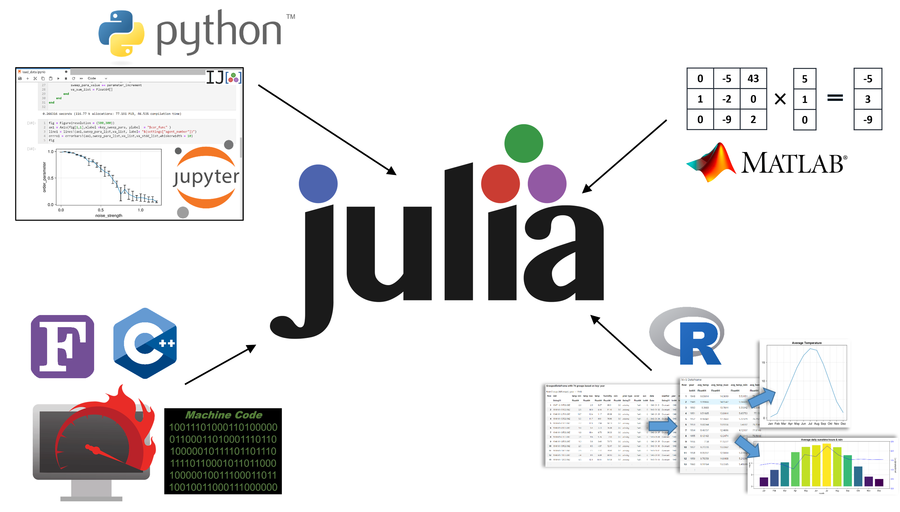

 

# Scientific programming in Julia - An introductory course

# Summary
This course provides an introduction into the scientific programming language `Julia`. No previous knowledge is necessary to follow the nine course lectures. Every lecture is presented in Jupyter Notebooks. Code examples are shown together with markdown cells explaining and elaborating on the code. Additionally, general concepts about programming in `Julia` are introduced. The lectures build on each other and should be finished in numerical order. The first five lectures cover the basic language syntax of `Julia` (e.g. data types, operators, package installation, functions, ...). The last four lectures are more specifically targeted towards scientific applications and cover the following topics: plotting, import/export of numerical data, data analysis and a simple agent-based simulation. Each lecture ends with exercises, where the students directly apply the concepts that have been introduced. Sample solutions for all exercises are provided. 

# Get started 

To run the course material on your local machine, clone this [github repository]( https://github.com/AndreasKuhn-ak/WS2022_Julia). Download and install [Anaconda](https://www.anaconda.com/download#downloads) and [Julia](https://julialang.org/downloads/) for your operating system. Install the package [IJulia](https://datatofish.com/add-julia-to-jupyter/) with your local `Julia` installation. Now you can start using the Jupyter Notebooks of the course. Any additional packages used in the course are installed and introduced in the chapter "packages" with the integrated `Julia` packages manager.  
 
For a first experience without any prior installation, you can also use [mybinder](https://mybinder.org/v2/gh/AndreasKuhn-ak/WS2022_Julia/HEAD) to directly execute the Jupyter notebooks in your browser. Unfortunately, this comes with some restrictions: Due to the limited server capacities of mybinder, the container building phase takes quite some time and can sometimes fail, and the GPU accelerated plotting in the ninth part will not work. You should also keep in mind that your changes will only be saved as long as your browser session is active, but you can download the changed notebooks to your local machine. 

# Statement of Need 

The `Julia` programming language first appeared in 2012  and had been specifically designed for numerical computation and data science. Since then, the combination of speed and interactivity distinguishes `Julia` from other languages in that realm. Over the years, it has undergone a rapidly growing adaptation to various fields of science, ranging from black holes  to quantum systems in physics to applications in biology, economics , machine learning  and many more. This fast acceptance of a new programming language is quite remarkable, as programming languages are a field that is historically known to be very slow at pivoting (e.g. ``Python`` and ``C++`` are both over 30 years old). 
 
One reason for this is that ``Julia`` solves the two language problem that has been tormenting many researchers for decades. It essentially means, that different specialized languages are used for different tasks in the same project. To give an example, ``Python`` or ``Matlab`` are often used for plotting and fast prototyping, ``R`` for statistical analyses and compiled languages like ``C/++`` or ``Fortran`` for the computationally heavy parts. Using two or more languages in one project creates a lot of unnecessary overhead: Firstly, researcher have to spend more time learning to code in two languages (especially true for low level languages like ``C/++`` or ``Fortran``), and secondly, exchanging data and logic between languages can be very tedious and time-consuming.    

Julia solves this problem, as all the mentioned tasks can be accomplished in Julia alone. Its simple syntax is heavily inspired by Python, which allows equally fast prototyping . The plotting package ``Makie``  provides similar capabilities as ``matplotlib`` in ``Python`` or ``ggplot2`` in ``R``. The meta package ``StatsKit`` includes all necessary tools to do sophisticated statistical analysis. And most importantly, ``Julia`` is fast. Depending on the benchmark, ``Julia`` is on pair or within a factor of 2 to ``C`` . 

## Target audience 
The main target audience of this course is scientists/students who want to use or already use programming in their work. However, no prerequisites apart from basic algebra and statistics (high school level) are needed. Anybody with that requirement should be able to follow the course without problems.

Programmers who already have experience in other languages should be able to finish the first five lessons quite fast, as a lot of general programming concepts are introduced there as well. But the last four more `Julia` specific lessons should be very useful for them, too.

Even though there are already free Julia courses available online ([1](https://carpentries-incubator.github.io/julia-novice/),[2](https://www.datacamp.com/courses/introduction-to-julia),[3](https://juliaacademy.com/courses)), we believe, that this course offers great additional value for (new) scientific programmers, as it does not require any prior knowledge, is self-contained with chapters that build up on one another, introduces many relevant topics for scientific applications and offers exercises together with solutions to each chapter. 

Therefore, we invite everybody to either use the course materials in idependent self study to learn `Julia` or to use the course materials to teach Julia to others. 

# Details of the course

## Learning objectives 
The learning resource aims to enable learners to:

* use interactive notebooks 
* understand the basic structure of the `Julia` programming language
* use Julia in a scientifc context:
    * import/export data
    * analyse data
    * plot data
    * write a simple simulation
  

## Content
1. Jupyter Notebooks
2. Package Installation
3. Datatypes
4. Conditional Iterators
5. Functions
6. Plotting
7. Import/Export 
8. Data Analysis
9. Application: Simple Random Walk Simulation 

## Instructional design
The Jupyter notebooks contain four different types of cells: 
- General explanations
- Executable code examples
- Exercises
- Meta comments/hints/notes

The first three cell types are essential in understanding the contents of the course. The exercises are divided into three difficulties: easy, medium and hard. Easy and medium exercises can be solved using the content of the course alone, whereas some hard exercises require additional research to transfer the acquired knowledge to new problems.  The "meta" cells offer additional but non-essential information. This can be comments about the differences of `Julia` compared to other languages, advice on good coding practices, etc. While first time programmers can skip these cells if they want to, we expect the meta cells to be particularly useful for already experienced programmers switching to `Julia`.

# Community guidelines

In case you want to contribute or found an error in this course, please open a GitHub issue/pull request in the course repository. If you have questions or other problems/issues, feel free to write us a message in GitHub or an email.  

We encourage you to give us anonymus feedback using this [google form](https://docs.google.com/forms/d/e/1FAIpQLSd_gyiwqzYNADm88PXT4Xp6JlDAt0rR5s_2jZUXE2cJJmCEqQ/viewform?usp=sf_link).  
## Acknowledgements

We acknowledge contributions from Simon Schardt, Christopher Nauroth-Kreß and the various students who served as beta testers for this course. 
## License

Scientific programming in Julia - An introductory course by [Andreas Kuhn](https://github.com/AndreasKuhn-ak) and [Sabine Fischer](https://github.com/scfischer) is licensed under a [Creative Commons Attribution-ShareAlike 4.0 International License](https://creativecommons.org/licenses/by-sa/4.0/).

